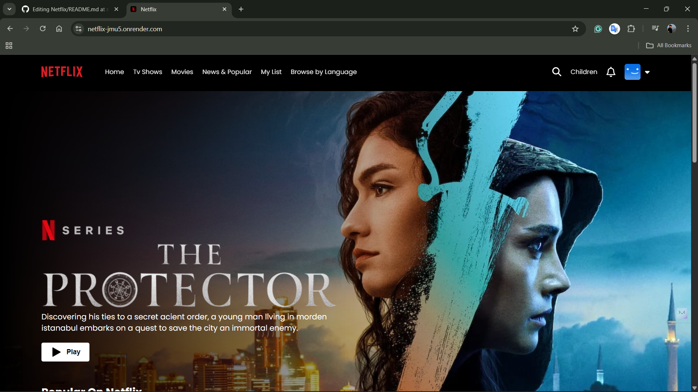
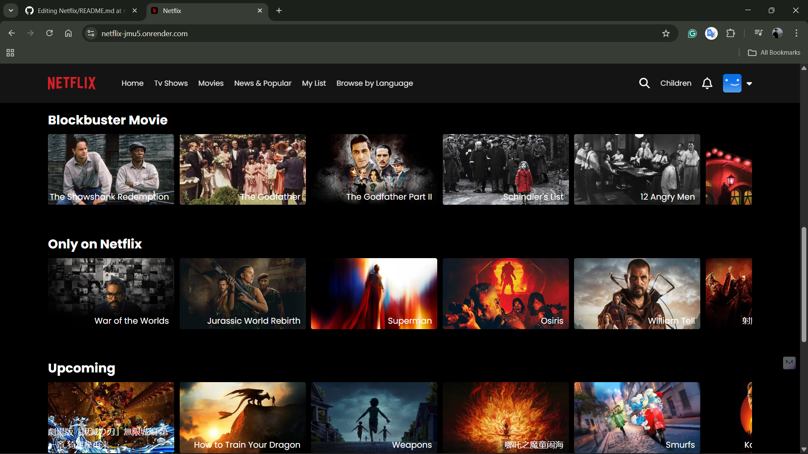

🎬 Netflix Clone
Live-https://netflix-jmu5.onrender.com/

## 📸 Screenshots  

  
  
  

A Netflix Clone built with React.js, CSS, Firebase Authentication, and The Movie Database (TMDB) API.
Users can sign up / log in, browse trending movies, and watch trailers directly.

✨ Features
🔐 User Authentication with Firebase (Sign Up / Sign In / Log Out)
🎞️ Browse Movies using TMDB API
🎬 Watch Trailers by clicking on movies (YouTube integration)
🔎 Dynamic Movie Rows like Netflix (Trending, Top Rated, Originals, etc.)
🎨 Responsive UI styled with CSS
⚡ Deployed Live (link below)

🛠️ Tech Stack

Frontend: React.js, CSS
Backend / Auth: Firebase Authentication
API: TMDB API for real time movies

Deployment: Render

Movie Trailer

⚙️ Setup & Installation

Clone the repository:

git clone https://github.com/adarsh005599/Netflix
cd netflix-clone

Install dependencies:

npm install
Create a .env file in the root and add your keys:
REACT_APP_TMDB_API_KEY=your_tmdb_api_key
REACT_APP_FIREBASE_API_KEY=your_firebase_api_key

Run the project locally:
npm start

Pull requests are welcome!

📜 License
This project is for educational purposes only. All rights for assets belong to Netflix & TMDB.
